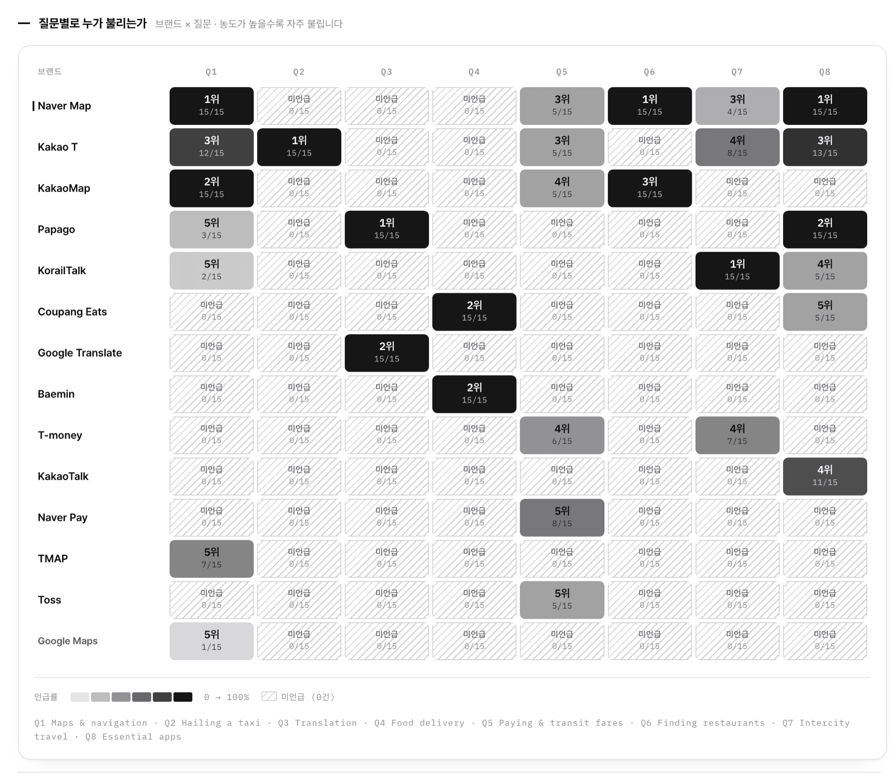
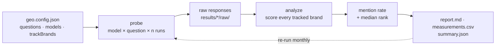

<div align="center">

# 🛰️ geo-probe

### Measure how discoverable a brand is *inside AI answers.*

When people ask ChatGPT, Gemini, or Claude for **"the best app for X"** — does your product come up? How often, and how high?
`geo-probe` measures it. **Repeated. Brand-blind. Honest.**

<br>


<br>

**[Open the live dashboard →](https://ai-visibility-monitor-psi.vercel.app)**
<br>
<sub>A real 120-response run across 3 models, with the raw numbers behind every cell.</sub>

</div>

<br>

<picture>
  <source media="(prefers-color-scheme: dark)" srcset="https://raw.githubusercontent.com/choiaewoooon/geo-probe/main/docs/screenshots/field-dark.png">
  
</picture>

<div align="center">
<sub><b>The field.</b> 14 apps, scored against the <i>same</i> 120 answers. Ink density is how often an app was named for that question; <b>hatched cells were never named at all</b> — <code>0/15</code> is a different fact from <i>“rarely,”</i> so it gets a different mark, not a lighter shade.
<br>
<sub>The dashboard UI is Korean; the questions the models were asked are in English, below.</sub></sub>
</div>

---

## Why this exists

Search is moving from *ten blue links* to *one generated answer*. If an AI assistant never names your product when a customer asks a category question, you're invisible — no matter how good your SEO is. That's the problem **GEO (Generative Engine Optimization)** tackles.

Most "GEO checks" ask the model *once* and eyeball the result. That's noise. `geo-probe` treats it as a **measurement problem**:

- 🕵️ **Brand-blind** — it never names your product in the question. It asks the category question your customer would ask.
- 🔁 **Repeated (n≥5)** — same question, many independent runs → a **mention rate** and a **median rank**, not a lucky single shot.
- 🧾 **Honest by design** — it records the exact model, web-search state, and date, and never inflates a single snapshot into an absolute ranking.

---

## What you get

A reproducible matrix. Here's a real run: **"which apps should a foreigner use in South Korea?"**, asked 8 different ways, 3 models, `n=5` — **120 answers, all 120 parsed.**

| App | Maps | Taxi | Translate | Delivery | Pay | Dining | Rail | Essentials |
|---|:---:|:---:|:---:|:---:|:---:|:---:|:---:|:---:|
| **Naver Map** | **100%** | — | — | — | 33% | **100%** | 27% | **100%** |
| **Kakao T** | **80%** | **100%** | — | — | 33% | — | 53% | **87%** |
| **KakaoMap** | **100%** | — | — | — | 33% | **100%** | — | — |
| **Papago** | 20% | — | **100%** | — | — | — | — | **100%** |
| **Coupang Eats** | — | — | — | **100%** | — | — | — | 33% |
| **Baemin** | — | — | — | **100%** | — | — | — | — |
| **KorailTalk** | 13% | — | — | — | — | — | **100%** | 33% |
| **Toss** | — | — | — | — | 33% | — | — | — |
| **Google Maps** | 7% | — | — | — | — | — | — | — |

> **Read it:** each number is the share of answers to that question that named the app. `—` means it was never named, not once.

Three things fall out of the data that a single query would not have told you:

- **Google Maps has effectively no presence.** The world's default map app is named in **1% of all answers** — and its only appearance is on the one question that *explicitly told the model Google Maps works poorly in Korea*. Ask about restaurants, transit, or what to install before you fly, and it does not come up at all.
- **KakaoMap and Naver Map tie where you'd expect and split where it matters.** Both hit 100% on maps and on restaurants. But on *"what should I install before travelling?"* — the question that decides what a first-time visitor actually downloads — Naver Map is named in **every** answer and KakaoMap in **none**. Same category, same capability, opposite outcome in the moment of choice.
- **Most apps own exactly one column.** Baemin, Google Translate, and Toss each appear for a single question and vanish everywhere else. That is not weak visibility; it is *narrow* visibility, and the two need different fixes.

That last point is why the dashboard **does not rank apps by overall mention rate.** Across 8 questions, an app that completely dominates one topic still tops out near 13%. Breadth and depth are shown as separate columns.

---

## Who is taking your spot

When your product *doesn't* show up, something else does. 66 distinct app names appeared across these answers; the dashboard lays them on one plate — area is how often it appeared, ink density is its share.

<picture>
  <source media="(prefers-color-scheme: dark)" srcset="https://raw.githubusercontent.com/choiaewoooon/geo-probe/main/docs/screenshots/treemap-dark.png">
  
</picture>

This is **share of the answers you tracked**, not market share — the dashboard says so on the same screen, every time.

---

## Where one product is weak

Pick any tracked brand and the rest of the dashboard follows it: the same grid, now split by **model** instead of by competitor.

<picture>
  <source media="(prefers-color-scheme: dark)" srcset="https://raw.githubusercontent.com/choiaewoooon/geo-probe/main/docs/screenshots/matrix-dark.png">
  
</picture>

Rows are questions, columns are models, and the number inside each cell is the median rank when the app was named. Hatched rows are your optimization backlog, in priority order.

---

## How it works



1. **probe** — for every model × question, ask *n* times in a fresh call, forcing a ranked-list answer, and save every raw response.
2. **analyze** — find each tracked brand's first position in each list → **mention rate** and **median rank** per cell.
3. **report** — write a Markdown matrix + a long-format `measurements.csv` (one row per run) you can append to month over month.

Because the questions never name a brand, **one probe run scores every brand you track.** 14 apps above came out of a single 120-call run, not 14 of them.

---

## Quickstart

```bash
git clone https://github.com/choiaewoooon/geo-probe.git
cd geo-probe

# 1. configure your target
cp geo.config.example.json geo.config.json     # edit questions · models · trackBrands

# 2. add the API keys for the models you use
cp .env.example .env                            # fill OPENAI_API_KEY / GEMINI_API_KEY / ANTHROPIC_API_KEY

# 3. run (probe + analyze)
npm run run
```

No build step, **zero dependencies** (Node 18+ `fetch` only). Output lands in `results/<timestamp>/report.md`.

Then open the dashboard:

```bash
npm run export && npm run serve      # → http://localhost:4178
```

> Don't want to use API keys? Point a model at your own local CLI instead — see [`examples/command-adapter.config.json`](examples/command-adapter.config.json). Any executable that takes a prompt as its last argument works. The run above was collected that way.

---

## The dashboard

`npm run serve` opens a static, dependency-free dashboard over `summary.json`. It is two-tone on purpose: **value is carried by ink density, never by colour**, so the same plate reads identically in print, in a screenshot, and to a colour-blind reader.

| Screen | What it answers |
|---|---|
| **판세** Field | How the tracked brands split the category, and which one to look at next |
| **요약** Summary | Where the selected brand stands — rate, top-3 rate, median rank, consistency, completeness |
| **경쟁 구도** Competition | Who took the spot when it didn't show up, and who it's always named alongside |
| **질문·모델 진단** Diagnosis | Which exact question and model it's weak in |
| **출처** Sources | Which domains the answers cited, and how much of that was the brand's own |
| **원문 증거** Evidence | Where every raw response is stored, per run |
| **측정 실행** Run | Run a measurement from the browser; keys and results never leave it |

Four things the dashboard refuses to do, deliberately:

- **No single composite score.** Blending mention rate, rank, and share under invented weights manufactures false precision. It shows status labels instead.
- **No 0% for "unmeasurable."** If no model returned a citation, own-domain citation rate is reported as *not measurable* — not as `0%`. Those are different facts.
- **No ranking by overall mention rate.** It penalises narrow-but-dominant products, so breadth and depth get their own columns.
- **No consistency score in the field view.** A product that is never named scores 96% "consistent," which looks like praise. It's dropped where it would mislead.

---

## Configure

Everything lives in one `geo.config.json`:

```jsonc
{
  "brand": "Naver Map",                        // the default subject
  "trackBrands": ["Naver Map", "KakaoMap",     // …and everyone else scored from the same answers
                  "Kakao T", "Papago", "Toss"],
  "repeats": 5,                                // runs per model × question
  "spacingMs": 8000,                           // gap between calls (rate-limit friendly)
  "rankedListSuffix": "\n\nAnswer with only the 5 most suitable apps, as a numbered list…",
  "models": [
    { "id": "chatgpt", "name": "ChatGPT", "provider": "openai",    "model": "gpt-4o",            "webSearch": false },
    { "id": "gemini",  "name": "Gemini",  "provider": "gemini",    "model": "gemini-1.5-pro",    "webSearch": false },
    { "id": "claude",  "name": "Claude",  "provider": "anthropic", "model": "claude-sonnet-4-5", "webSearch": false }
  ],
  "questions": [
    { "id": "q1", "short": "Maps & navigation",
      "prompt": "I'm a foreigner visiting South Korea. Which map and navigation apps should I use?" }
  ],
  "competitorAliases": {                       // aliases are shared, not duplicated per brand
    "KakaoMap": ["카카오맵", "Kakao Map", "Daum Map"],
    "Papago":   ["파파고", "Naver Papago"]
  }
}
```

`trackBrands` is the one to know: list the names you care about and every one of them is scored against the same responses, pulling aliases from `competitorAliases`. Leave it out and the tool behaves exactly as before, measuring `brand` alone.

Providers: `openai` · `gemini` · `anthropic` · `command` (your own CLI). The full config behind the run above is [`configs/korea-apps.json`](configs/korea-apps.json).

---

## Output

```
results/2026-08-24-03-17/
├── raw/<model>/<question>-run<n>.txt   # every original response, untouched
├── measurements.csv                    # long-format: model,question,run,rank,web_search
└── report.md                           # the matrix + a one-line summary
```

`measurements.csv` is intentionally **long-format** — one row per run — so appending next month's run turns it straight into a time series.

---

## Methodology & honesty

This tool is opinionated about *not lying with data*:

- **Conditions are recorded, not hidden.** Web-search state and model id travel with every result. Different conditions → reported as such, never as an absolute comparison.
- **The median ignores non-mentions.** A cell shows the median rank *of the runs that named the brand*, plus the count — so a high rank on 1/5 runs can't masquerade as consistent.
- **Ranks come only from what the model actually returned.** If a response isn't a ranked list, the run is scored *mentioned / not-mentioned* with no invented position.
- **Changing the questions breaks the line.** The trend chart refuses to connect points measured with different question sets, because a redesign would otherwise look like progress.
- **A snapshot is a snapshot.** Results shift with model versions, search indexes, and time. `geo-probe` gives you a repeatable observation, not a market-share claim.

---

## Use it as a Claude Code skill

Drop this repo where your Claude Code skills live (or install it as a plugin). [`SKILL.md`](SKILL.md) lets you just say:

> *"Measure how discoverable Acme is in AI answers for the cloud-security category."*

…and Claude will configure, run, and interpret the probe for you — following the same brand-blind, repeated, honest method.

---

<div align="center">

Built by [Jaewon Choi](https://jaewon-choi.vercel.app). MIT licensed.
<br>
<sub>If a customer can't find you in the answer, you're not in the market. Measure it.</sub>

</div>
