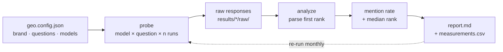

<div align="center">

# 🛰️ geo-probe

### Measure how discoverable your brand is *inside AI answers.*

When people ask ChatGPT, Gemini, or Claude for **"the best company for X"** — does your brand come up? How often, and how high?
`geo-probe` measures it. **Repeated. Brand-blind. Honest.**

<br>


</div>

---

## Why this exists

Search is moving from *ten blue links* to *one generated answer*. If an AI assistant never names your brand when a customer asks a category question, you're invisible — no matter how good your SEO is. That's the problem **GEO (Generative Engine Optimization)** tackles.

Most "GEO checks" ask the model *once* and eyeball the result. That's noise. `geo-probe` treats it as a **measurement problem**:

- 🕵️ **Brand-blind** — it never mentions your brand in the question. It asks the category question your customer would ask.
- 🔁 **Repeated (n≥5)** — same question, many independent runs → a **mention rate** and a **median rank**, not a lucky single shot.
- 🧾 **Honest by design** — it records the exact model, web-search state, and date, and never inflates a single snapshot into an absolute ranking.

---

## What you get

A reproducible matrix. Here's a real run for **Burson** (a WPP communications agency), Korean market, `n=5`:

| Question (brand hidden) | ChatGPT | Gemini | Claude |
|---|:---:|:---:|:---:|
| Global PR / comms firms | 4th `(5/5)` | 4th `(5/5)` | 4th `(5/5)` |
| Reputation & crisis | 4.5th `(2/5)` | 4th `(5/5)` | 5th `(4/5)` |
| GenAI PR analytics | **2nd** `(5/5)` | 4th `(3/5)` | 3rd `(5/5)` |
| KR social listening | — `(0/5)` | 4th `(1/5)` | — `(0/5)` |

> **Read it:** `4th (5/5)` = named 4th in all five runs. `— (0/5)` = never appeared.
>
> **Takeaway the data hands you:** Burson is *reliably* found (~4th), but the **#1 spot is rare** (2 of 60 runs, both ChatGPT on the AI-analytics question) and it is **nearly absent for Korean social-listening** (1 of 15 runs). That last row isn't a verdict — it's your **first optimization target**.

The single-shot version of this same probe *missed* the two #1 rankings entirely. That's why repetition matters.

---

## How it works



1. **probe** — for every model × question, ask *n* times in a fresh call, forcing a ranked-list answer, and save every raw response.
2. **analyze** — find your brand's first position in each list → compute **mention rate** and **median rank** per cell.
3. **report** — write a Markdown matrix + a long-format `measurements.csv` (one row per run) you can append to month over month.

---

## Quickstart

```bash
git clone https://github.com/choiaewoooon/geo-probe.git
cd geo-probe

# 1. configure your target
cp geo.config.example.json geo.config.json     # edit brand · questions · models

# 2. add the API keys for the models you use
cp .env.example .env                            # fill OPENAI_API_KEY / GEMINI_API_KEY / ANTHROPIC_API_KEY

# 3. run (probe + analyze)
npm run run
```

No build step, **zero dependencies** (Node 18+ `fetch` only). Output lands in `results/<timestamp>/report.md`.

> Don't want to use API keys? Point a model at your own local CLI instead — see [`examples/command-adapter.config.json`](examples/command-adapter.config.json). Any executable that takes a prompt as its last argument works.

---

## Configure

Everything lives in one `geo.config.json`:

```jsonc
{
  "brand": "Burson",
  "brandAliases": ["버슨", "BCW"],       // counted as the same brand
  "repeats": 5,                          // runs per model × question
  "spacingMs": 8000,                     // gap between calls (rate-limit friendly)
  "models": [
    { "id": "chatgpt", "name": "ChatGPT", "provider": "openai",    "model": "gpt-4o",           "webSearch": false },
    { "id": "gemini",  "name": "Gemini",  "provider": "gemini",    "model": "gemini-1.5-pro",   "webSearch": false },
    { "id": "claude",  "name": "Claude",  "provider": "anthropic", "model": "claude-sonnet-4-5", "webSearch": false }
  ],
  "questions": [
    { "id": "q1", "short": "Global PR firms", "prompt": "한국에서 글로벌 PR·커뮤니케이션 컨설팅 회사를 추천해줘." }
  ]
}
```

Providers: `openai` · `gemini` · `anthropic` · `command` (your own CLI). Add or remove models and questions freely.

---

## Output

```
results/2026-07-14-08-30/
├── raw/<model>/<question>-run<n>.txt   # every original response, untouched
├── measurements.csv                    # long-format: model,question,run,rank,web_search
└── report.md                           # the matrix + a one-line summary
```

`measurements.csv` is intentionally **long-format** — one row per run — so appending next month's run turns it straight into a time series.

---

## Methodology & honesty

This tool is opinionated about *not lying with data*:

- **Conditions are recorded, not hidden.** Web-search state and model id travel with every result. Different conditions → reported as such, never as an absolute comparison.
- **The median ignores non-mentions.** A cell shows the median rank *of the runs that mentioned the brand*, plus the mention count — so a high rank on 1/5 runs can't masquerade as consistent.
- **Ranks come only from what the model actually returned.** If a response isn't a ranked list, the run is scored *mentioned / not-mentioned* with no invented position.
- **A snapshot is a snapshot.** Results shift with model versions, search indexes, and time. `geo-probe` gives you a repeatable observation, not a market-share claim.

---

## Use it as a Claude Code skill

Drop this repo where your Claude Code skills live (or install it as a plugin). [`SKILL.md`](SKILL.md) lets you just say:

> *"Measure how discoverable Acme is in AI answers for the cloud-security category."*

…and Claude will configure, run, and interpret the probe for you — following the same brand-blind, repeated, honest method.

---

<div align="center">

Built by [Jaewon Choi](https://jaewon-choi.vercel.app). MIT licensed.
<br>
<sub>If a customer can't find you in the answer, you're not in the market. Measure it.</sub>

</div>
