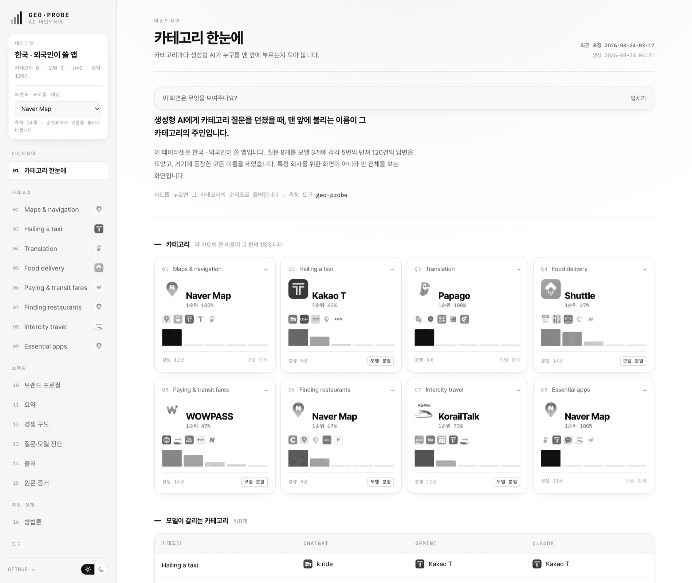
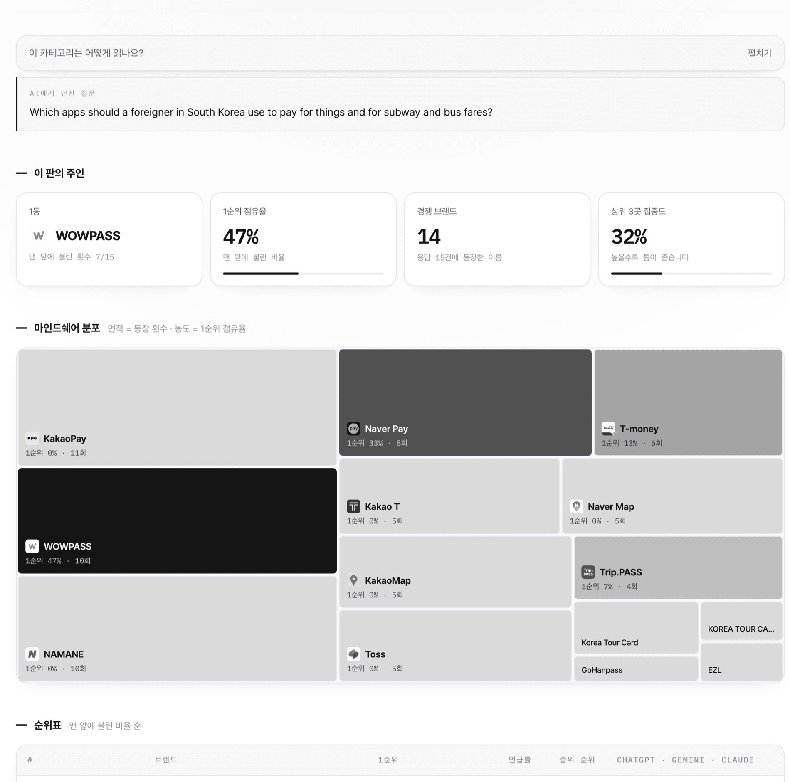
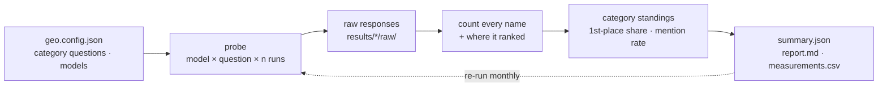

<div align="center">

# 🛰️ geo-probe

### Who does AI name **first** in your category?

Ask ChatGPT, Gemini, or Claude *"which app should I use for X"* and one name comes out on top.
`geo-probe` measures which one, how reliably, and who is quietly losing the spot. **Repeated. Brand-blind. Honest.**

<br>


<br>

**[Open the live dashboard →](https://ai-visibility-monitor-psi.vercel.app)**
<br>
<sub>8 categories · 120 answers · every name that came up, counted.</sub>

</div>

<br>

<picture>
  <source media="(prefers-color-scheme: dark)" srcset="https://raw.githubusercontent.com/choiaewoooon/geo-probe/main/docs/screenshots/home-dark.png">
  
</picture>

<div align="center">
<sub>One card per category. The big name is whoever generative AI puts <b>at the top of the list</b> — not whoever gets mentioned most.
<br>
<sub>The dashboard UI is Korean; the questions the models were asked are in English, below.</sub></sub>
</div>

---

## This is not a brand dashboard

Most AI-visibility tools start by asking *"what's your brand?"* and then tell you where you rank. That's useful if you already know you're a contender. It tells you nothing about the category.

`geo-probe` starts from the other end. **There is no "your brand" here.** You define a category question, it asks the models over and over, and it counts every name that comes back. The output is a standings table for the category:

| Category | Who AI names first | 1st-place share | Runner-up | Model consensus |
|---|---|:---:|---|:---:|
| Maps & navigation | **Naver Map** | 100% | KakaoMap (0%) | ✓ |
| Hailing a taxi | **Kakao T** | 60% | k.ride (33%) | **split** |
| Translation | **Papago** | 100% | Google Translate (0%) | ✓ |
| Food delivery | **Shuttle** | 47% | Coupang Eats (40%) | **split** |
| Paying & transit fares | **WOWPASS** | 47% | Naver Pay (33%) | **split** |
| Finding restaurants | **Naver Map** | 67% | Catch Table (33%) | **split** |
| Intercity travel | **KorailTalk** | 73% | Klook (27%) | **split** |
| Essential apps | **Naver Map** | 100% | Papago (0%) | ✓ |

> Real run: *"which apps should a foreigner use in South Korea?"* asked 8 ways × 3 models × `n=5` = **120 answers, all 120 parsed**, 66 distinct app names counted.

---

## Why "first" and not "mentioned"

Being in the list and being at the top of it are different outcomes, and conflating them hides the interesting cases.

In the **payments** category, `KakaoPay` is named in **73%** of answers — more than anyone. It is *never* named first: **0%**. The app that actually owns the slot is `WOWPASS`, a foreigner-only prepaid card, at 47% first-place share on a lower 67% mention rate.

<picture>
  <source media="(prefers-color-scheme: dark)" srcset="https://raw.githubusercontent.com/choiaewoooon/geo-probe/main/docs/screenshots/cat-dark.png">
  
</picture>

Read the treemap: **area is how often a name appeared, ink density is how often it came first.** The biggest tile is also the palest one — that is KakaoPay, permanently a candidate and never the default. The dashboard tags that state explicitly rather than letting a single ranking hide it.

---

## What the data said

- **The world's default can be absent.** `Google Maps` appears in **1%** of all answers, and only on the one question that explicitly told the model Google Maps works poorly in Korea. Ask about restaurants, transit, or what to install before flying, and it never comes up.
- **Niche beats incumbent when the question changes.** For *"I don't speak Korean, which delivery app can I use?"*, the winner is `Shuttle` — a small English-first service — ahead of `Coupang Eats` and `Baemin`, the actual market leaders. The category question, not market share, decides the answer.
- **Five of eight categories have no agreed winner.** Different models put different names first. That isn't one model being wrong; it means the category has no settled default yet — which is exactly where a new entrant can still take the slot.

---

## How it works



1. **probe** — for every model × question, ask *n* times in a fresh call, forcing a ranked-list answer, and save every raw response.
2. **analyze** — parse each list and count every name that appears, with the position it appeared at.
3. **export** — build per-category standings, plus an optional per-brand profile for names you want to track over time.

The questions never contain a brand name, so **one run scores the whole category at once** — the 66 names above came from a single 120-call run.

---

## Quickstart

```bash
git clone https://github.com/choiaewoooon/geo-probe.git
cd geo-probe

cp geo.config.example.json geo.config.json   # write your category questions
cp .env.example .env                          # OPENAI_API_KEY / GEMINI_API_KEY / ANTHROPIC_API_KEY

npm run run                                   # probe + analyze
npm run export && npm run serve               # → http://localhost:4178
```

No build step, **zero dependencies** (Node 18+ `fetch` only).

Optional — cache App Store icons so the dashboard shows real app logos:

```bash
node scripts/fetch-logos.mjs
```

> No API keys? Point each model at a local CLI instead — see [`examples/command-adapter.config.json`](examples/command-adapter.config.json). The run above was collected that way.

---

## The dashboard

Two-tone on purpose: **value is carried by ink density, never by colour**, so a plate reads the same in print, in a screenshot, and to a colour-blind reader. App icons are rendered in greyscale for the same reason.

| Screen | What it answers |
|---|---|
| **카테고리 한눈에** Categories | Who leads every category, and where the models disagree |
| **카테고리 상세** Category | Standings, mindshare treemap, and the leader per model |
| **브랜드 프로필** Brand profile | Optional drill-down: where one name lives across categories |
| **방법론** Method | Questions, models, calculation rules, and the limits |
| **측정 실행** Run | Run a measurement from the browser; keys never leave it |

Four things it refuses to do:

- **No single composite score.** Blending mention rate, rank, and share under invented weights manufactures false precision.
- **No 0% for "unmeasurable."** If no model returned a citation, that's reported as *not measurable*, not as `0%`.
- **No ranking by overall mention rate.** Across 8 questions a category-owning app still tops out near 13%, so breadth and depth are separate columns.
- **No consistency score where it misleads.** A name that never appears scores 96% "consistent," which reads like praise.

---

## Configure

```jsonc
{
  "dataset": { "name": "Apps for foreigners in Korea" },
  "repeats": 5,
  "questions": [                                 // one question = one category
    { "id": "q1", "short": "Maps & navigation",
      "prompt": "I'm a foreigner visiting South Korea. Which map and navigation apps should I use?" }
  ],
  "trackBrands": ["Naver Map", "KakaoMap"],      // optional per-brand profiles
  "competitorAliases": {                         // same name, different spellings
    "KakaoMap": ["카카오맵", "Kakao Map", "Daum Map"]
  },
  "models": [
    { "id": "chatgpt", "name": "ChatGPT", "provider": "openai", "model": "gpt-4o", "webSearch": false }
  ]
}
```

Only `questions` and `models` are required — category standings need no brand list at all. `trackBrands` is opt-in, for names you want a time series on. Providers: `openai` · `gemini` · `anthropic` · `command` (your own CLI). Full config behind the run above: [`configs/korea-apps.json`](configs/korea-apps.json).

---

## Output

```
results/2026-08-24-03-17/
├── raw/<model>/<question>-run<n>.txt   # every original response, untouched
├── measurements.csv                    # long-format: model,question,run,rank,web_search
└── report.md                           # the matrix + a one-line summary
```

`measurements.csv` is **long-format** — one row per run — so appending next month's run turns it into a time series.

---

## Methodology & honesty

- **Conditions are recorded, not hidden.** Web-search state and model id travel with every result, and the dashboard refuses to rank models against each other because of it.
- **The median ignores non-mentions.** A rank is the median *of the runs that named it*, shown next to the count.
- **Ranks come only from what the model returned.** Not a ranked list → scored mentioned / not-mentioned, with no invented position.
- **Changing the questions breaks the line.** Trend charts won't connect points measured with different question sets.
- **A snapshot is a snapshot.** Results shift with model versions and search indexes. This is a repeatable observation, not a market-share claim.

App icons come from the public iTunes Search API and are shown only to identify which app a row refers to. They belong to their respective owners.

---

## Use it as a Claude Code skill

Drop this repo where your Claude Code skills live. [`SKILL.md`](SKILL.md) lets you say:

> *"Find out which vendor AI recommends first for cloud security."*

…and Claude will write the questions, run the probe, and read the standings back to you.

---

<div align="center">

Built by [Jaewon Choi](https://jaewon-choi.vercel.app). MIT licensed.
<br>
<sub>Search returns a list. AI returns one answer. Measure who that answer is.</sub>

</div>
